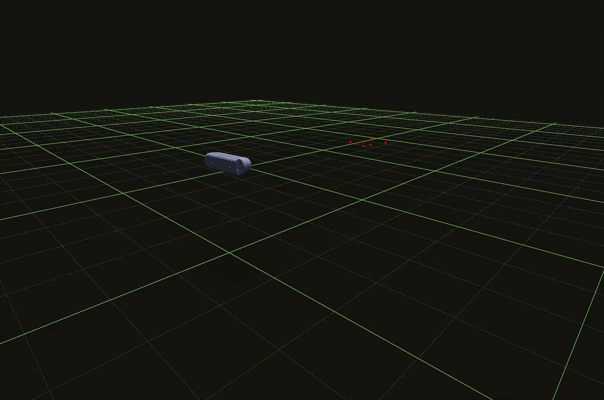
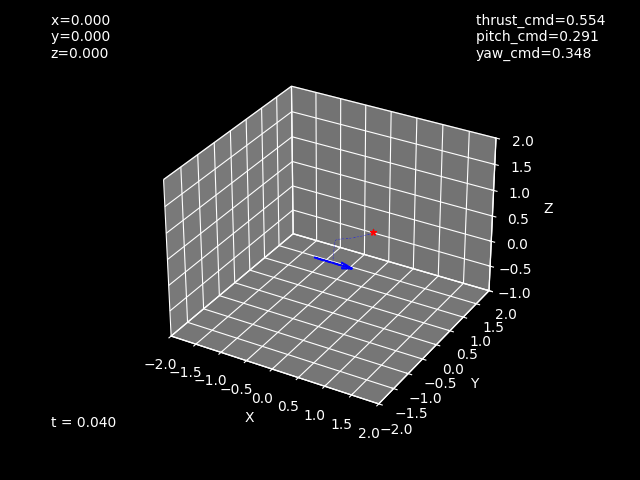

# Discovering a Novel Way to Annoy my Wife by Learning A Little Control Theory

## Some Background

Way back in 2018 I splurged some money that would have otherwise disappeared 
into the coffers of Subway corporation (I was in college) on a remarkably well 
reviewed toy drone called the Syma S107-g. For the uninitiated, this toy employs
a few clever mechanical tricks to ensure ease of use, whether you're an already skilled 
pilot or one of the fabled Wrong Brothers.

First, the model helicopter stacks two counter-rotating rotors along the same shaft to provide
upward thrust without spinning the body of the helicopter. These rotors can be run at different speeds
to induce a rotation in yaw. Next, a smaller upwards facing rotor 
near the tail can be throttled to pitch the body forward, changing the thrust vector and moving
the helicopter in the direction of its nose. The real cleverness, however, is in the gyro stabilizer.
Through a sort of franken-swashplate, the precession-induced torques from a gyro bar mounted to the top
rotor are able to change the pitch of the top blades, resulting in a stabilizing effect that massively
simplifies the control of the helicopter. Flying it is essentially like operating a 3D 
[turtle](https://en.wikipedia.org/wiki/Turtle_graphics), which brings us to this project. With luck, I'll have this thing zipping around the apartment
knocking into things and generally causing a ruckus.

Retroactively, I realize this is a study in the myriad applications of singular value decomposition, 
so I will provide a counter for convenience (SVD Count: 0)

## The Scheme

The idea is to programmatically control the helicopter to follow pre-determined flight paths to some
reasonable (and then progressively unreasonable) degree of precision in both time and space, the pursuit
of which should hopefully serve as a rich sandbox in which to try out some concepts from Control Theory
that have remained squarely in the theoretical realm for me thus far. Sounds easy enough!

## lol, lmao even

I am surely in good and varied company to arrive at the conclusion that Control Theory is hard. In my case,
this difficulty spans a few areas:

### Constraints
- The helicopter cannot carry much, if any, weight. So I have to keep added mass to less than a few grams. This rules out any sort of onboard hardware like an IMU.
- The helicopter is quite fast! Any math I need to do should run upwards of 60 fps so as to not miss too much motion. This can be relaxed if the physical model of the helicopter is high-fidelity.

### Kalman Filtering
I read this excellent [book](https://github.com/rlabbe/Kalman-and-Bayesian-Filters-in-Python) by Roger Labbe to wrap my mind around the once intimidating Kalman Filter. I highly recommend it. I found a few limitations with his again, excellent, filterpy library for my use case, which led to me implementing a more stable/faster version in jax ([here](helicopter/vision/sqrt_ukf.py)). This version operates in the [square root domain](https://ieeexplore.ieee.org/document/940586) to avoid NPD errors during Sigma Point computation. 

### Vision
This is where the bulk of the effort lives. I picked up a used RealSense d435i camera from back when they were an Intel subsidiary on eBay. If you've never worked with these, they're amazing, even more so considering they've been around for a while. The support community is fantastic and the documentation is accessible enough. Although I did have some difficulty in getting the camera to work with my setup, in which I treat my PC running WSL as a remote server, and connect to it from my laptop via ssh. But that's another write-up.
- #### Measurement + Point Registration
  - This part nearly drove me nuts. The idea is to plaster the helicopter with retroreflective markers, measure their 3d locations, then use this map to track the helicopter orientation as it flies through the air.
  - Scanning the helicopter requires knowing the camera's location very precisely as I move it to capture all sides of the helicopter. I think I could have used ARUCO markers to skip all this despite the helicopter's small size, but that wouldn't have been as cool, which is also a constraint.
  - I ended up using my SR-UKF to fuse motion data from the camera's on-board IMU with measured data from the depth cameras. The d435i has an onboard laser projector (which I diffused like [these guys](https://github.com/stytim/RealSense-ToolTracker) did) to illuminate the points, but the projector was not strong enough to illuminate the markers enough for simple thresholding to work. After mucking about with openCV's blob detector + a few other last ditch computer vision approaches, I bit the bullet and just trained a YOLO model on some sample images. The resulting model is quite fast (~10ms) and has yet to exhibit a limit to its generalization. The [Muon](https://kellerjordan.github.io/posts/muon/) optimizer is kinda magical (SVD count: 1).
  - Tuning the Kalman filter took more time than I care to admit. In particular, I found that a simple average of gyro data collected during static initialization led to bad bias estimates for my sensor; so I was stuck between leaving the bias with high uncertainty so it could be corrected, potentially stealing some signal from actual motion during the scan, and locking in a bad estimate which would catastrophically accumulate during integration. I fixed this by noticing that the gyro noise had a cyclic component, which was affecting my finite-length average calculation via spectral leakage. So like any good Fourier analyst I slapped a window function on the signal and the problem went away.
  - Scanning the points looks like 
  - After some manual cleanup and identifying points belonging to some reference surfaces, normal vectors can be computed (SVD count: 2) and registered to align with my coordinate system
- #### Tracking
  - The [Kabsch algorithm](https://en.wikipedia.org/wiki/Kabsch_algorithm) (SVD count: 3) is the name of the game here. If I can find a correspondence between points found in an arbitrary frame during flight and my reference map, I can compute the translation and orientation the helicopter must have undergone.
  - Finding the correspondence is a little tricky, but essentially I compute the distances between points, then create the 3-vector corresponding to the distances between points in every possible triangle. I then use this point to look up the closest triangle from the reference set with a KD-Tree and take the answer with the smallest error. Testing this with simulated points shows a pretty good resistance to noise. This approach is quite slow with a complexity of O(N3), so it's run as part of the initialization/homing step at the start of a flight. During flight, I can switch to the much faster ICP algorithm (SVD count: 4). 

### Control
I forayed into this project mostly because of the lectures by [Brian Douglas](https://www.youtube.com/@BrianBDouglas/videos). The goal is to use the aforementioned tracking platform as a sandbox to bring some ideas from the lectures into the real world. This consists of a few parts. 

#### Simulation
While cheap, I would prefer to not destroy the helicopter on its first flight. After converting the simplified helicopter dynamics to a system of differential equations, Scipy's solve_ivp function can evolve the system over time to give me an idea of how my PID parameters will perform. While copious approximations and estimations were used, it at least generates a cool plot:

#### PID Tuning Hell
Some characteristics of the helicopter such as the time constant of the rotors, the spring constant equivalent of the gyro stabilizer, and the moments of inertia can only feasibly be measured during flight. This requires that tracking works well, but high fidelity tracking can only be achieved with a model which the kalman filter can parse. Sounds like a job for iterative gradient descent, except I'm the optimizer.

## Future Directions
I envision a fun application for this being a sort of augmented reality board game, where moves made by players can be 
realized by the helicopter in real life. Maybe some aerobatics through some fiducial-labeled hoops would be satisfying. 
Really, as with most projects like this, the true satisfaction comes from knowing that it works how I designed it to.
The code is designed to accept different control paradigms, and I've been looking to work my way up the skill tree: 
LQR, MPC, and then finally a neural engine. Supporting two helicopters sounds like a fun challenge as well.

If for some unfathomable reason you want to do this yourself, open an issue and prepare for your keyboard to have a forehead
shaped indentation.
